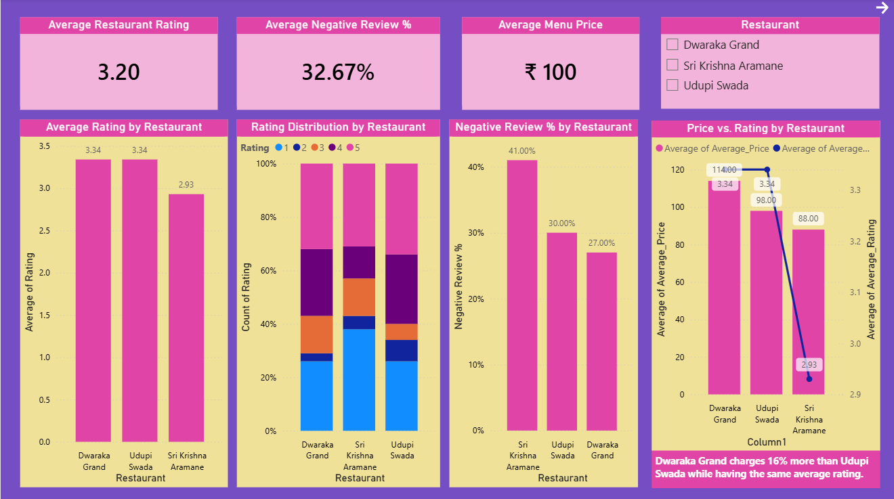
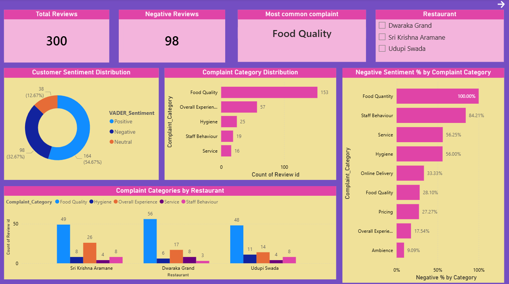
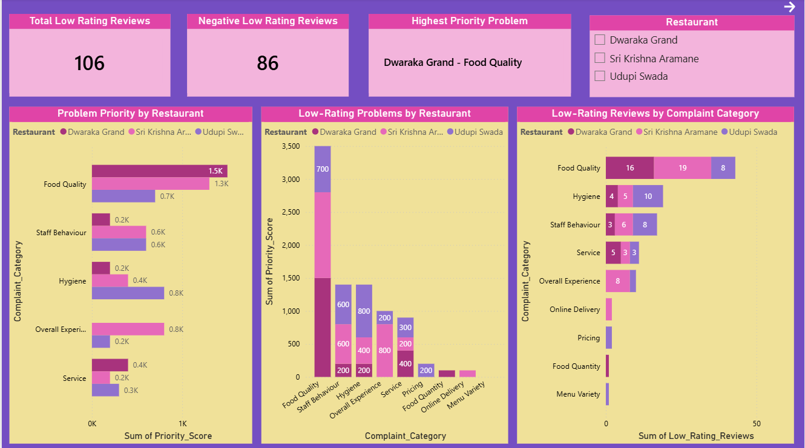

# Local Business Audit V2 – Restaurant Competitive & Customer Feedback Analysis

## 📌 Project Overview

This project analyzes customer reviews, ratings, complaints, and menu prices of three local restaurants to understand how the target restaurant performs compared with its competitors.

Version 2 improves the original analysis by using Python and Pandas for data cleaning, sentiment analysis, exploratory analysis, and problem diagnosis before presenting the final insights through a Power BI dashboard.

The project focuses on identifying customer pain points, comparing restaurant performance, and understanding whether the target restaurant's premium pricing is aligned with customer ratings and feedback.

---

## 🎯 Business Question

**How does the target restaurant perform relative to its competitors, and does its premium pricing align with customer ratings and feedback?**

---

## 🎯 Project Objectives

1. Compare the average ratings of the three restaurants.
2. Analyze customer sentiment from reviews.
3. Identify the most common complaint categories.
4. Identify the main problems appearing in low-rated reviews.
5. Compare menu prices across restaurants.
6. Provide data-driven recommendations for improvement.

---

## 📊 Dataset

The project uses a constructed restaurant review dataset containing:

- 300 customer reviews
- 3 restaurants
- 100 reviews per restaurant
- Customer ratings from 1 to 5
- Review text
- Complaint categories
- Restaurant information
- Menu prices

### Main Data Sources

- Review data
- Restaurant information
- Menu data

> **Data Note:** The review dataset is constructed/assumed data created for analytical practice and is not a live scrape of Google Reviews. Review dates are not treated as verified real-world dates and are therefore not used for time-based conclusions.

---

## 🔄 Project Workflow

Excel / CSV Data  
↓  
Python + Pandas  
↓  
Data Cleaning & Validation  
↓  
Sentiment Analysis using VADER  
↓  
Exploratory Data Analysis  
↓  
Complaint & Problem Analysis  
↓  
Competitor Benchmarking  
↓  
Final Analytical CSVs  
↓  
Power BI Dashboard  
↓  
Business Insights & Recommendations

---

## 🛠️ Tools & Technologies

- Python
- Pandas
- VADER Sentiment Analysis
- Excel
- Power BI
- DAX
- GitHub

---

# 🐍 Python Analysis

The main analysis was performed using Python and Pandas.

The Python script includes:

- Data loading
- Data quality checks
- Duplicate and missing-value checks
- Restaurant-level analysis
- Rating analysis
- Sentiment analysis
- Complaint category analysis
- Low-rating problem analysis
- Priority scoring
- Menu price analysis
- Competitor benchmarking
- Exporting final analytical datasets

---

## 🧹 Data Quality Checks

The dataset was checked for:

- Missing values
- Duplicate records
- Data types
- Review counts by restaurant

The dataset contains **300 reviews**, with **100 reviews for each restaurant**.

---

# 😊 Sentiment Analysis

VADER was used to calculate sentiment scores from the review text.

Each review was classified as:

- Positive
- Neutral
- Negative

The VADER results were compared with the manually assigned sentiment labels.

### VADER Validation

**Manual vs VADER agreement: 79.33%**

This validation was performed to check how closely the automated sentiment classification matched the existing manual labels.

---

# ⭐ Rating Analysis

### Average Rating

| Restaurant | Average Rating |
|---|---:|
| Dwaraka Grand | 3.34 |
| Sri Krishna Aramane | 2.93 |
| Udupi Swada | 3.34 |

Dwaraka Grand and Udupi Swada have the same average rating of **3.34**, while Sri Krishna Aramane has the lowest average rating at **2.93**.

### Negative Review Percentage

| Restaurant | Negative Reviews |
|---|---:|
| Dwaraka Grand | 27% |
| Sri Krishna Aramane | 41% |
| Udupi Swada | 30% |

Sri Krishna Aramane has the highest percentage of negative reviews.

---

# 🗣️ Complaint Analysis

The most common complaint categories across all restaurants were:

| Complaint Category | Reviews |
|---|---:|
| Food Quality | 153 |
| Overall Experience | 57 |
| Hygiene | 25 |
| Staff Behaviour | 19 |
| Service | 16 |
| Ambience | 11 |
| Pricing | 11 |
| Menu Variety | 4 |
| Online Delivery | 3 |
| Food Quantity | 1 |

### Key Observation

**Food Quality** is the most common complaint category, with **153 reviews**.

However, complaint frequency alone was not used to decide which problems should be addressed first. Low ratings and negative sentiment were also considered.

---

# 🔎 Low-Rating Problem Analysis

Reviews with ratings of **1 or 2 stars** were analyzed separately to identify problems associated with poor customer experiences.

A project-defined **Priority Score** was used to combine the number of low-rated reviews with their negative sentiment percentage.

**Priority Score = Low-Rating Reviews × Negative Sentiment %**

> **Note:** This is a project-defined prioritization heuristic. It is not a formal statistical or causal metric. It is used only to help rank recurring customer problems.

### Main Problem Areas

#### Dwaraka Grand

- Food Quality
- Service
- Staff Behaviour

#### Sri Krishna Aramane

- Food Quality
- Overall Experience
- Staff Behaviour

#### Udupi Swada

- Hygiene
- Food Quality
- Staff Behaviour

---

# 💰 Pricing Analysis

Average menu prices were compared across the three restaurants.

| Restaurant | Average Menu Price | Average Rating |
|---|---:|---:|
| Dwaraka Grand | ₹114 | 3.34 |
| Sri Krishna Aramane | ₹88 | 2.93 |
| Udupi Swada | ₹98 | 3.34 |

Dwaraka Grand's average menu price is approximately **16% higher than Udupi Swada**, while both restaurants have the same average rating of **3.34**.

This raises a **value-for-money question** for the target restaurant.

> The analysis does not establish that higher prices cause lower customer satisfaction. The pricing comparison is used to identify a potential value-for-money concern.

---

# 📈 Key Findings

### 1. Dwaraka Grand does not have the highest rating

Dwaraka Grand has an average rating of **3.34**, equal to Udupi Swada.

Sri Krishna Aramane has the lowest average rating at **2.93**.

### 2. Sri Krishna Aramane has the highest negative sentiment

Negative reviews account for:

- Dwaraka Grand — **27%**
- Sri Krishna Aramane — **41%**
- Udupi Swada — **30%**

### 3. Food Quality is the biggest complaint category

Food Quality appears in **153 reviews**, making it the most common complaint category across the dataset.

### 4. Dwaraka Grand has a pricing-value concern

Dwaraka Grand has:

- Average menu price: **₹114**
- Average rating: **3.34**

Udupi Swada has:

- Average menu price: **₹98**
- Average rating: **3.34**

Therefore, Dwaraka Grand charges a higher average price without having a higher average rating than Udupi Swada.

### 5. Different restaurants have different problem areas

The low-rating analysis shows that the main customer problems are not identical across restaurants.

This allows recommendations to be more specific rather than applying the same solution to every restaurant.

---

# 📊 Power BI Dashboard

The final Power BI dashboard contains **3 pages**.

## 1. Overview

This page provides an executive-level summary of:

- Average restaurant rating
- Average negative review percentage
- Average menu price
- Rating comparison
- Rating distribution
- Negative review percentage
- Price vs rating comparison



---

## 2. Customer Sentiment & Complaints

This page focuses on:

- Customer sentiment distribution
- Complaint category distribution
- Negative sentiment by complaint category
- Complaint categories by restaurant



---

## 3. Problem Diagnosis

This page focuses on:

- Low-rated reviews
- Negative low-rated reviews
- Priority problems
- Low-rating problem categories
- Restaurant-level problem comparison



---

# 💡 Business Recommendations

### 1. Improve Food Quality

Food Quality is the largest complaint category.

The restaurant should investigate recurring food-related complaints and focus on consistency in:

- Taste
- Freshness
- Preparation
- Portion consistency

### 2. Improve Service

Service-related complaints should be monitored, especially where they appear repeatedly in low-rated reviews.

Possible actions include:

- Reducing waiting time
- Improving order handling
- Monitoring peak-hour service
- Improving staff coordination

### 3. Improve Staff Behaviour

Staff Behaviour is an important problem area in low-rated reviews.

Training can focus on:

- Customer communication
- Professional behaviour
- Handling complaints
- Responsiveness

### 4. Strengthen Value for Money

Since Dwaraka Grand has a higher average menu price than Udupi Swada while having the same average rating, the restaurant should focus on increasing perceived value.

Possible strategies include:

- Value-based meal combinations
- Targeted promotions
- Better portion/value communication
- Improving high-demand dishes

A blanket price reduction is not necessarily required.

### 5. Monitor Customer Feedback Regularly

Customer reviews can be tracked regularly to identify whether complaint categories and sentiment improve after operational changes.

---

# ⚠️ Limitations

1. The review dataset is constructed/assumed and is not a live Google Reviews dataset.
2. Review dates are not verified real-world dates and are not used for time-based analysis.
3. Sentiment analysis can misclassify some reviews, especially mixed or context-dependent statements.
4. The Priority Score is a project-defined heuristic and should not be interpreted as a formal statistical measure.
5. The analysis identifies associations and patterns but does not prove that one factor causes another.
6. Menu prices represent the dataset used for this project and may not reflect current real-world prices.
7. The dataset contains only three restaurants, so the findings should not be generalized to the entire restaurant market.

---

# 🚀 Future Improvements

The project can be extended by:

- Using real review data through permitted data sources
- Adding review-level time analysis using verified dates
- Applying more advanced NLP techniques
- Using topic modeling to discover complaint themes automatically
- Adding customer segmentation
- Tracking sentiment changes over time
- Adding competitor price tracking
- Building automated Power BI data refresh
- Adding statistical testing to evaluate relationships between price, ratings, and sentiment

---

# 📁 Project Structure

```text
Local-business-audit-v2/
│
├── README.md
├── analysis.py
├── requirements.txt
│
├── overview.png
├── customer_sentiment_complaints.png
├── problem_diagnosis.png
│
└── output/
    ├── restaurant_benchmark.csv
    ├── problem_analysis.csv
    ├── rating_summary.csv
    ├── review_analysis.csv
    ├── dish_price_comparison.csv
    └── low_rating_analysis.csv
```

# ▶️ How to Run

### 1. Clone the repository
```bash
git clone https://github.com/Shakshi-Jalan/Local-business-audit-v2.git
```

### 2. Open the project folder
```bash
cd Local-business-audit-v2
```

### 3. Install the required libraries
```bash
pip install -r requirements.txt
```

### 4. Add the Excel workbook
Place the Excel workbook in the same folder as `analysis.py`.  
The raw Excel workbook is not included in the public repository.

### 5. Run the analysis
```bash
python analysis.py
```

The script will generate the analytical CSV files inside the `output/` folder.

---

# 📄 Output Files

| File | Description |
|------|-------------|
| `restaurant_benchmark.csv` | Restaurant-level rating, sentiment and price benchmark |
| `problem_analysis.csv` | Complaint category and negative sentiment analysis |
| `rating_summary.csv` | Rating distribution summary |
| `review_analysis.csv` | Review-level analysis with VADER sentiment |
| `dish_price_comparison.csv` | Dish-level price comparison |
| `low_rating_analysis.csv` | Low-rating problem and priority analysis |

---

# 🧠 Skills Demonstrated

- Data Cleaning
- Data Validation
- Exploratory Data Analysis
- Python
- Pandas
- Sentiment Analysis
- VADER
- Customer Feedback Analysis
- Complaint Categorization
- Competitor Benchmarking
- Business Problem Solving
- Data Visualization
- Power BI
- DAX
- Dashboard Design
- Business Recommendations

---

# 👩‍💻 Author

**Shakshi Jalan**  
Electronics & Telecommunication Engineering Student  
Dayananda Sagar College of Engineering, Bengaluru  
Aspiring Data Analyst

---

# ⭐ Project Summary

This project demonstrates an end-to-end analytics workflow where raw customer review and restaurant pricing data is transformed into business insights using Python, Pandas, VADER, and Power BI.

The main goal is not just to build a dashboard, but to use data to understand customer problems, competitor performance, pricing position, and possible business actions.
This project demonstrates an end-to-end analytics workflow where raw customer review and restaurant pricing data is transformed into business insights using Python, Pandas, VADER, and Power BI.

The main goal is not just to build a dashboard, but to use data to understand customer problems, competitor performance, pricing position, and possible business actions.
